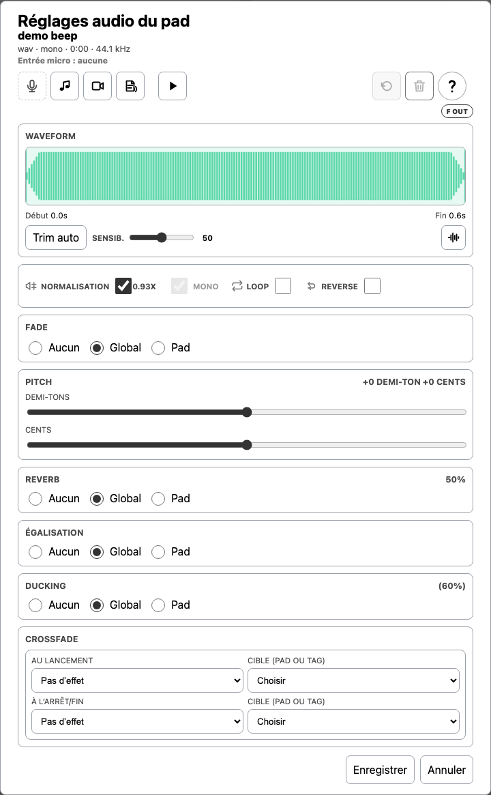
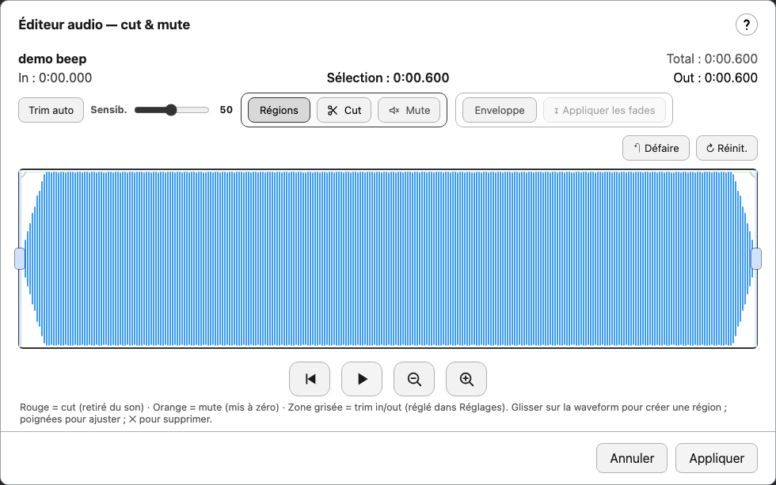
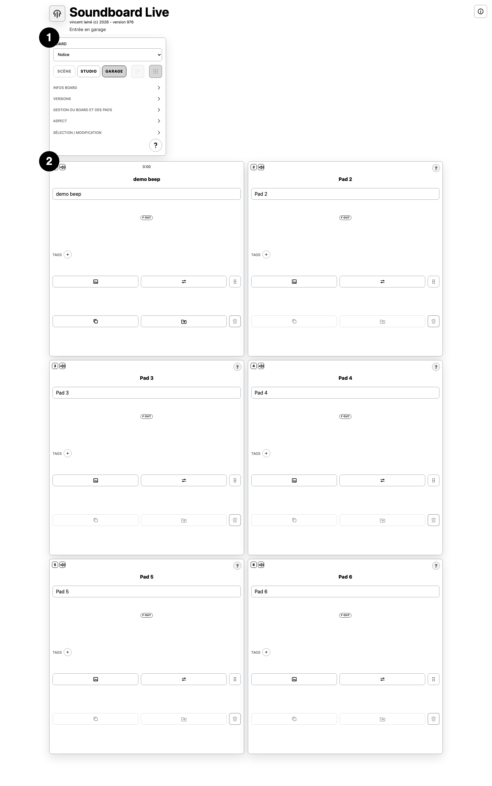
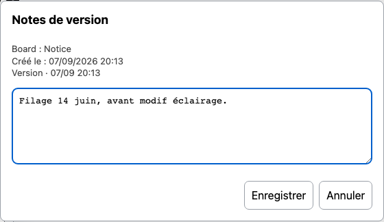
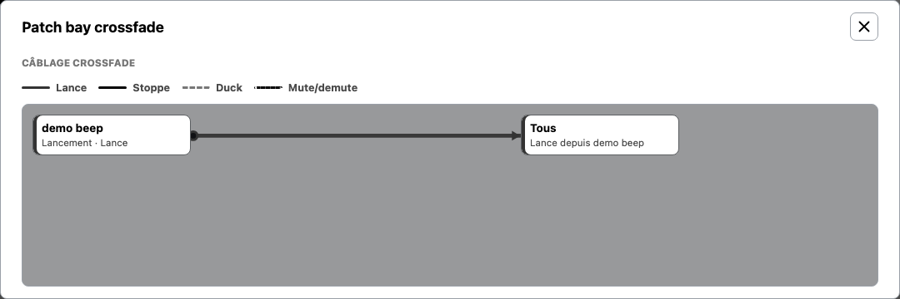
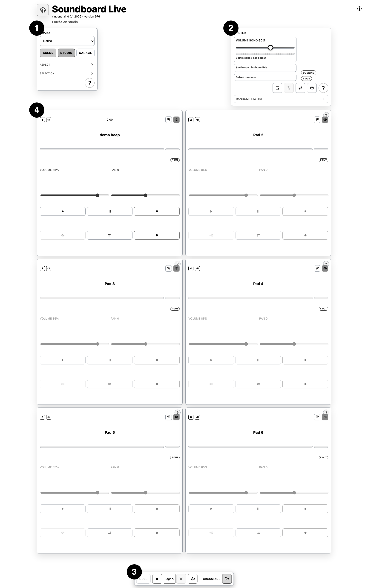
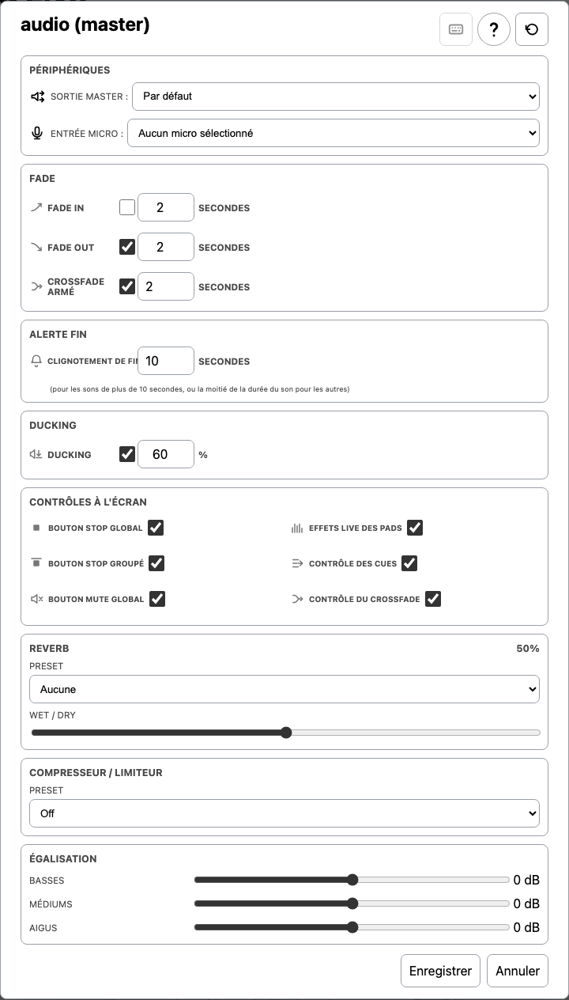
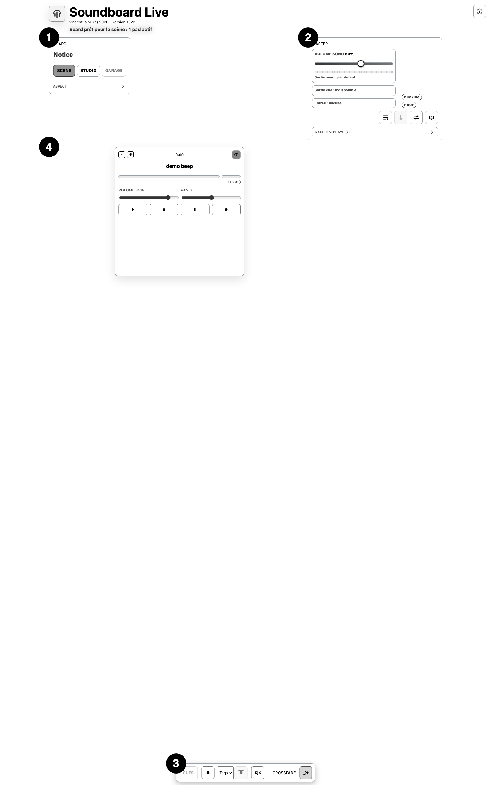
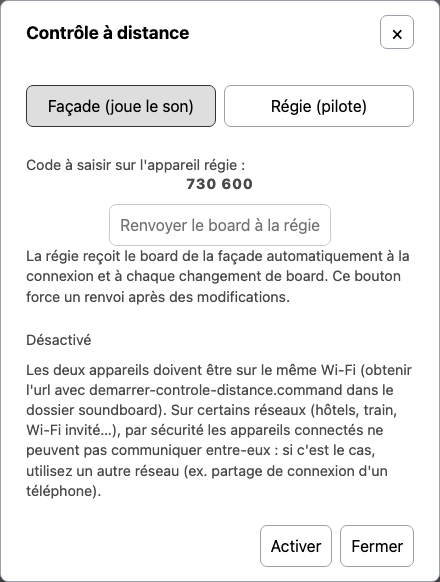

# Soundboard VL — Notice de fonctionnement

Soundboard VL est une application web de gestion et de déclenchement sonore conçue pour la régie de spectacle. Elle permet d'importer et organiser des sons, de construire des boards de pads avec leurs réglages individuels (volume, fondu, boucle, effets), de programmer des cues et des crossfades, de jouer en direct depuis une interface épurée dédiée à la scène, de personnaliser l'apparence du board via des skins, et de piloter le tout à distance depuis un second appareil.

## Sommaire

1. Les trois espaces
2. Mode Garage — construction
3. Mode Studio — répétition
4. Commandes globales (Master) — tous modes
5. Audio Master
6. Effets live par pad
7. Mode Scène — live
8. Contrôle à distance (régie/façade)
9. Skins et apparence
10. Glossaire
11. Compatibilité navigateurs
12. Licence

## Les trois espaces

L'application s'articule autour de trois espaces distincts, plus un axe transversal pour piloter le spectacle depuis un second appareil.

### Le Garage

Bibliothèque centrale des ressources sonores. C'est ici qu'on importe, organise et prévisualise les fichiers audio. Les sons sont rangés par catégories et restent disponibles pour être assignés à des cues _(voir glossaire)_.

### Le Studio

Espace de composition et de configuration des boards _(voir glossaire)_. On y construit les blocs de cues, règle les paramètres de chaque son (volume, fondu, boucle, enchaînement), et structure le déroulement du spectacle.

### La Scène

Vue de performance en temps réel. Interface épurée pour la régie _(voir glossaire)_ : déclenchement des cues à la volée, contrôle du volume global, indicateurs d'état, changement de board.

> Le **contrôle à distance** (régie/façade) est indépendant de ces trois espaces : il relie deux appareils en direct pour piloter le spectacle depuis un second appareil pendant qu'un premier joue le son réel — voir le chapitre dédié.

## Mode Garage — construction

> On construit : créer et éditer les sons, organiser le board et les pads.

### Board

- ![#addPad] **Ajouter un pad** _(voir glossaire)_ : ajoute un nouveau pad vide au board courant.
- ![#addBoard|#duplicateBoard] **Ajouter un board / Dupliquer** : crée un nouveau board (le créateur, saisi à la création, ne peut plus être changé ensuite) ou duplique le board courant avec tous ses pads.
- ![#relinkAudioFolder] **Sélectionner un dossier de sons** : relie le board à un dossier local pour retrouver les fichiers audio. À refaire si le dossier est déplacé.
- ![#relinkVideoFolder] **Sélectionner un dossier de vidéos** : relie le board à un dossier local pour les fichiers vidéo.
- ![#undoBoardEdit] **Annuler la dernière modification** : annule le dernier réglage modifié ou le dernier pad supprimé (pas à pas).
- ![#cancelBoardEdit] **Annuler les modifications du board** : restaure le board tel qu'il était à l'entrée dans le mode (annulation globale).
- ![#exportBoard] **Exporter le board** : exporte le board avec ou sans les sons. Les vidéos ne sont pas incluses, il faut les conserver à part puis les relier via « Sélectionner un dossier de vidéos ».

- ![#importBoard] **Importer un board** : importe un board depuis un fichier JSON, avec ou sans audio embarqué.
- ![#boardInfoNotice] **Notice du board** : génère automatiquement une notice du board courant aux formats DOC et PDF (liste des pads, durées, versions).
- ![#openShareAdmin] **Partage du board : invitation et gestion** : ouvre la console de partage — crée un lien d'invitation, protégé par un mot de passe, donnant à un invité un accès limité au board courant, et gère les invitations déjà créées (liste, révocation, mots de passe). L'invité évolue dans un espace cloisonné, sans accès aux autres boards ni aux réglages du garage.
- ![#openSkinEditorButton] **Éditeur de skin** _(voir glossaire)_ : personnalise l'apparence visuelle du board — couleurs, harmonie chromatique, polices.
- ![#boardInfoAudioLibrary] **Sons stockés** : liste les sons utilisés (triable par fichier, board ou taille) et non utilisés (triable par nom ou taille). Ce stockage est propre au navigateur, pas au système de fichiers — utiliser « Sauvegarder tous les sons… » (un sous-dossier par board sur le Finder, ou un zip en repli) ou l'export du board pour une copie durable ; ni l'un ni l'autre ne reprend cependant les sons qui n'existent plus que dans une version sauvegardée du board.
- ![#boardInfoDelete] **Supprimer le board** : supprime définitivement le board après confirmation.

### Pad — Import de médias

- ![#audioImport] **Importer un fichier audio** : charge un fichier audio local (mp3, wav, ogg…) dans le pad.
- ![#audioVideoImport] **Importer un fichier vidéo** : charge un fichier vidéo local dans le pad.
- ![#audioRecord] **Micro** : enregistre directement au microphone et assigne l'enregistrement au pad (il remplace le son en place). Le contour de l'icône indique l'état : **pointillé** = aucun micro sélectionné, le clic ouvre la fenêtre de choix du micro, il faut ensuite recliquer sur l'icône pour lancer l'enregistrement ; **vert** = micro sélectionné, prêt à enregistrer ; **rouge** = enregistrement en cours, recliquer pour l'arrêter. Le micro choisi est mémorisé d'une session à l'autre et se change dans Audio master (Entrée micro). L'enregistrement exige une connexion HTTPS (ou localhost).
- ![#audioTextImport] **Lecture de texte** : saisit ou importe un texte à lire (synthèse vocale ou affichage).

### Pad — Réglages audio

- **Trim auto** _(voir glossaire)_ : détecte et coupe automatiquement les silences en début et fin de son. Le curseur **Sensib.** qui l'accompagne règle le seuil de détection : plus haut, les sons faibles sont considérés comme du son et donc conservés (on coupe moins) ; plus bas, seuls les passages francs sont gardés (on coupe plus). Le réglage est commun aux réglages audio du pad et à l'éditeur audio, et il est mémorisé d'une session à l'autre.
- ![#audioRegionsEdit] **Éditeur audio** : éditeur complet — trim, cut, mute de zones, enveloppe de volume.

- ![action:loop] **Loop** : répète le son en boucle continue.
- ![#audioReverse] **Reverse** : lit le son à l'envers.
- ![#audioFadeIn|#audioFadeOut] **Fade in / out individuel** : durée de fondu propre à ce pad (prioritaire sur le réglage master).
- **Égalisation du pad** : égaliseur appliqué à ce pad uniquement.
- ![action:duck] **Duck trigger** : ce pad déclenche le ducking _(voir glossaire)_ des autres pads quand il joue.
- **Crossfade audio** _(voir glossaire)_ : configure les déclenchements croisés entre pads ou entre tags.

### Sélection groupée

- **Filtre par tag (OU / ET)** : sélectionne visuellement les pads par type, option ou tag — OU : au moins un des tags ; ET : tous les tags.
- ![#filterInvertBtn|#filterTousBtn] **Inverser / Effacer la sélection** : inverse les pads sélectionnés / désélectionne tout.
- ![#filterCompactToggle] **Masquer les pads non sélectionnés**.
- **Modification groupée** : applique un réglage à tous les pads sélectionnés en une seule opération.

## Mode Studio — répétition

> On règle et on répète : peaufiner les sons, vérifier les niveaux, tester cues et fades.

### Versions du board

- ![#saveVersion] **Sauvegarder une version** : crée un instantané local du board courant (8 versions maximum hors archives).
- **Restaurer une version** : choisir une version dans le menu déroulant la restaure aussitôt.
- ![#versionNotes] **Notes de version** : attache une note de texte libre (jusqu'à 1200 caractères) à la version sélectionnée — utile pour noter le contexte d'un filage (ex. « Filage 14 juin, avant modif éclairage »).

- ![#renameVersion] **Renommer une version** : donne un nom explicite à une version (ex : « Filage 14 juin »).
- ![#archiveVersion] **Archiver une version** : protège une version de l'écrasement automatique (elle ne compte plus dans le quota de 8).
- ![#deleteVersion] **Supprimer une version** : supprime définitivement la version sélectionnée.
- **Skin** : change l'apparence visuelle du board (skin prédéfini) — détails au chapitre Skins et apparence.

### Pad en Studio

- **One shot** _(voir glossaire)_ : relance le son depuis le début à chaque déclenchement.
- **Toggle** : premier clic lance, second clic stoppe et reprend à la même position au prochain déclenchement.
- ![action:stop] **Stop** : arrête le pad en appliquant les règles de fade out définies.
- ![action:cue-preview] **Pré-écoute Cue** : écoute le pad sur une sortie audio séparée (casque régie) sans l'envoyer en salle — dépend du navigateur et de la configuration audio.
- ![action:note] **Pense-bête du pad** : note de texte libre attachée au pad, visible en studio.
- ![action:mute] **Mute / Demute** : coupe ou rétablit le son du pad sans le supprimer de la séquence.
- ![action:visual-image] **Image du pad** : affecte une image, un dessin ou une couleur au pad (selon le skin actif).
- ![action:duplicate-pad|action:transfer-pad|action:drag] **Dupliquer / Transférer / Déplacer** : duplique le pad, le copie/déplace vers un autre board, ou réordonne les pads par glisser-déposer.

### Cues

- ![#cueEditor] **Activer les cues** : active ou désactive le mode cue pour le board. En mode cue, les pads se déclenchent selon la séquence programmée.
- ![#cueNext] **Cue suivant** : affiche le prochain cue sans le lancer (anticipation).
- ![#cueRun] **Lancer le cue courant** : exécute le cue en attente (déclenchement principal en régie).
- ![#resetCuePosition] **Revenir au début des cues** : réinitialise la séquence au premier cue.
- ![#addCueStep] **Ajouter une étape cue** : insère une nouvelle étape dans la ligne de temps des cues.

### Crossfade

- ![#showCables] **Xfade armé** : prépare un fondu enchaîné manuel entre deux pads, indépendamment de l'activation des cues. Si un seul pad audio joue, il devient la source. S'il y en a plusieurs, choisir la source puis le pad cible — le pad cible démarre en fondu entrant pendant que la source baisse puis s'arrête. La durée utilisée est celle réglée dans l'Audio Master. Annulation : touche Échap ou second clic sur Xfade.
- ![#patchBay] **Patch bay crossfade** : vue dédiée du câblage crossfade pour configurer les enchaînements complexes entre pads et groupes.

## Commandes globales (Master) — tous modes

- ![#stopAll] **Tout arrêter** : arrête immédiatement tous les pads en cours de lecture.
- ![#stopGroup] **Arrêter un groupe** : stop groupé — arrête uniquement les pads du tag choisi dans le menu (le bouton reste désactivé tant qu'aucun tag n'est sélectionné).
- ![#masterMute] **Mute global** : coupe ou rétablit le son en sortie sans arrêter les pads.
- ![#randomGroupToggle] **Random playlist** : choisir un tag (ou « Tous » pour tous les pads audio du board) et un nombre de pads simultanés (min et max, tiré au hasard entre les deux à chaque lancement), puis lancer — pioche sans répétition parmi les pads audio du groupe, en remplaçant chaque pad dès qu'il se termine. Reclic pour arrêter. Désactive le crossfade (automatique et manuel) tant qu'elle tourne.

## Audio Master

- **Fade in / Fade out global** : durée de fondu entrant et sortant appliquée par défaut à tous les pads (sauf réglage individuel).
- **Ducking global** : atténuation automatique des autres pads lorsqu'un pad prioritaire se déclenche.
- **Panneau d'effets live** : active ou désactive le panneau flottant d'effets par pad — voir le chapitre Effets live par pad.
- **Reverb globale** : réverbération appliquée globalement à l'ensemble des sorties audio.
- **Compresseur / limiteur global** : preset de compression appliqué en sortie master (Doux, Punchy, Broadcast — ce dernier agissant comme un vrai limiteur), avec compensation de gain automatique.
- **Égalisation globale** : égaliseur appliqué en sortie master.
- ![#keyboardShortcuts] **Raccourcis clavier** : gestion des raccourcis clavier pour déclencher les pads sans souris.

## Effets live par pad

Chaque pad dispose de 4 effets appliqués en direct pendant la lecture : distorsion, filtre, flanger, delay. Deux points d'accès pour les mêmes réglages :

- ![#liveFxPanelDock] **Panneau flottant** : déplaçable et rabattable, une rangée apparaît automatiquement pour chaque pad en cours de lecture. Par sécurité, les effets sont coupés (bypass _(voir glossaire)_) à chaque nouvelle lecture — il faut les réactiver explicitement.
- **Verso du pad, en mode Scène uniquement** : double-clic (ou double-tap) sur une zone vide du pad pour le retourner et retrouver les mêmes 4 curseurs, prêts d'emblée (pas de bypass automatique ici) — pratique pour préparer un effet sur un son trop court pour le manipuler en direct via le panneau flottant.
- **Remise à zéro** : double-clic (ou double-tap) sur un curseur pour le ramener à sa valeur neutre.
- Les réglages sont mémorisés par pad d'une session à l'autre.
- Le panneau flottant peut être désactivé globalement dans **Audio Master → Effets live → Afficher le panneau**.
- Ces 4 curseurs sont aussi pilotables à distance depuis la régie — voir Contrôle à distance.

## Mode Scène — live

- **Déclenchement des pads** : interface épurée sans les outils d'édition — seuls les contrôles de lecture sont accessibles.
- **Bascule recto/verso du pad** : double-clic (ou double-tap) sur une zone vide d'un pad pour révéler ses effets live au verso — voir Effets live par pad.
- **Changement de board** : le menu board reste accessible pour passer d'un board à l'autre au fil du spectacle.
- ![#stageLock] **Verrouiller le mode Scène** : protège la sortie du mode Scène par un mot de passe, pour éviter toute modification accidentelle pendant la représentation.
- **Bloc Cues/Crossfade** : quand les cues sont activées, le bloc s'étire à la largeur des pads (aligné sur eux) avec de gros boutons ; au défilement, il se fixe en haut de l'écran pour rester accessible. Inactif, il reste compact.

## Contrôle à distance (régie/façade)

Permet de piloter le board depuis un second appareil (téléphone, tablette) pendant qu'un premier appareil joue réellement le son. Les deux appareils doivent être sur le même réseau Wi-Fi.

### Mise en route

- **1. Lancer le relais** : exécuter `demarrer-controle-distance.command` (à la racine de l'app) — démarre un petit relais local, sans dépendance à internet, et affiche l'adresse `http://…` à utiliser sur les deux appareils.
- ![#remoteControlButton|#remoteRoleDisplay] **2. Côté façade** (l'appareil qui joue le son) : ouvrir Contrôle à distance, choisir le rôle Façade (joue le son) — un code à 6 chiffres s'affiche.
- ![#remoteRoleController] **3. Côté régie** (le second appareil) : ouvrir la même fenêtre, choisir Régie (pilote), saisir l'adresse du relais et le code affiché côté façade, puis Activer.

> Un avertissement s'affiche si l'app est ouverte en https (ex. hébergement en ligne) : le contrôle à distance a besoin d'une connexion non chiffrée (`ws://`), bloquée par le navigateur en https. Utiliser l'adresse `http://…` affichée par le script de lancement.

### Ce qui est piloté depuis la régie

La régie n'exécute jamais l'audio elle-même : elle envoie des commandes, la façade reste seule autorité sur le son réel.

- Déclenchement, arrêt, volume et pan des pads, loop, duck trigger, mute par pad
- Stop tout, Stop groupé par tag, Mute global, Volume master, Volume cue
- Cues : Suivant, Lancer, Retour au début
- Xfade armé : armement et choix de la cible
- Random playlist : réglages (groupe, min/max simultané), lancement et arrêt — le bouton régie reflète l'état réel de la façade
- Fenêtre Audio Master complète : fades, ducking, alerte fin, reverb, compresseur, égalisation (les périphériques — sortie, sortie cue, micro — restent propres à chaque appareil)
- Les 4 curseurs d'effets live par pad
- Bascule Studio/Scène : la façade fait autorité, la régie s'aligne automatiquement, même en la rejoignant après coup ; le mot de passe de verrouillage Scène n'est pas redemandé côté régie s'il a déjà été validé côté façade

Le mode Garage reste strictement local, hors du mécanisme de contrôle à distance.

### Limites

- Le relais n'est protégé que par le code à 6 chiffres, sans chiffrement (`ws://`) : à réserver à un réseau de confiance.
- Certains réseaux (Wi-Fi d'hôtel, de train, invité…) bloquent par sécurité la communication entre appareils connectés — utiliser un autre réseau (ex. partage de connexion d'un téléphone) si la connexion échoue.

## Skins et apparence

Le board peut adopter différents skins (apparences), choisis dans le menu Skin ou personnalisés dans l'éditeur de skin.

### Skin Basic/Custom

Skin dédié à l'affichage visuel des pads (image, dessin ou couleur plein cadre). Ses particularités :

- **Affichage illustré** : chaque pad montre son image, son dessin ou sa couleur en plein cadre, avec le titre en surimpression.
- **Rendu épuré** : lorsque l'illustration est affichée, les badges d'options audio (loop, EQ, reverb…), les tags et les contrôles sont masqués pour ne rien superposer à l'illustration — en studio comme en scène.
- **Mode « données »** : le bouton œil d'un pad masque son illustration ; le pad revient alors à l'affichage standard (titre, tags, contrôles, options), en studio comme en scène.
- **Règle générale** : illustration affichée → options et tags masqués ; illustration masquée (ou pad sans illustration) → options et tags visibles, dans les deux modes. Rien n'apparaît jamais par-dessus l'illustration.

## Glossaire

- **Board** : ensemble de pads organisés pour un spectacle ou une séquence donnée. On peut en créer plusieurs et passer de l'un à l'autre.
- **Pad** : bouton déclencheur associé à un son (ou une vidéo, ou un texte à lire), avec ses propres réglages (volume, fade, loop…).
- **Cue** : étape d'une séquence programmée de déclenchements. Le mode cue avance pas à pas dans cette séquence (Suivant / Lancer).
- **Crossfade (Xfade)** : fondu enchaîné entre deux pads — l'un baisse pendant que l'autre monte. « Xfade armé » désigne le crossfade manuel préparé en direct entre deux pads précis.
- **Ducking** : atténuation automatique des autres pads lorsqu'un pad prioritaire (« duck trigger ») se déclenche.
- **Trim** : découpe automatique des silences en début et fin d'un son.
- **Skin** : habillage visuel du board (couleurs, polices, affichage illustré des pads…), indépendant des réglages audio.
- **Régie / Façade** : les deux rôles du contrôle à distance — la façade joue le son réel, la régie pilote à distance depuis un second appareil sans jamais jouer le son elle-même.
- **Bypass** : coupure temporaire d'un effet, sans perdre ses réglages en mémoire.
- **One shot / Toggle** : deux comportements de déclenchement d'un pad — One shot relance depuis le début à chaque clic, Toggle alterne lecture/pause à la même position.

## Compatibilité navigateurs

Limites spécifiques à certains navigateurs uniquement.

| Fonctionnalité | Chrome | Firefox | Safari | Edge |
|---|---|---|---|---|
| Stockage persistant des projets | Oui | Oui | limité | Oui |
| Accès au système de fichiers local | Oui | Non | Non | Oui |
| Pré-écoute Cue (sortie séparée) | Oui | partiel | partiel | Oui |
| Enregistrement au micro | Oui | Oui | Oui | Oui |
| Synthèse vocale (lecture de texte) | Oui | Oui | Oui | Oui |

> Note finale : les fichiers audio sont stockés dans le navigateur, pas dans le Finder. Un rechargement sur un autre appareil ou navigateur nécessite de ré-importer les fichiers. Pour une sauvegarde durable, utiliser systématiquement « Exporter le board » avec les sons, ou « Sauvegarder tous les sons… » depuis la fenêtre Sons stockés — ces deux méthodes ne sauvegardent pas les sons qui n'existent plus que dans une version enregistrée du board (versions du board).

## Licence

Soundboard VL est distribué sous licence **Creative Commons Attribution — Pas d'Utilisation Commerciale — Partage dans les Mêmes Conditions 4.0 International (CC BY-NC-SA 4.0)**. Détails : https://creativecommons.org/licenses/by-nc-sa/4.0/deed.fr
